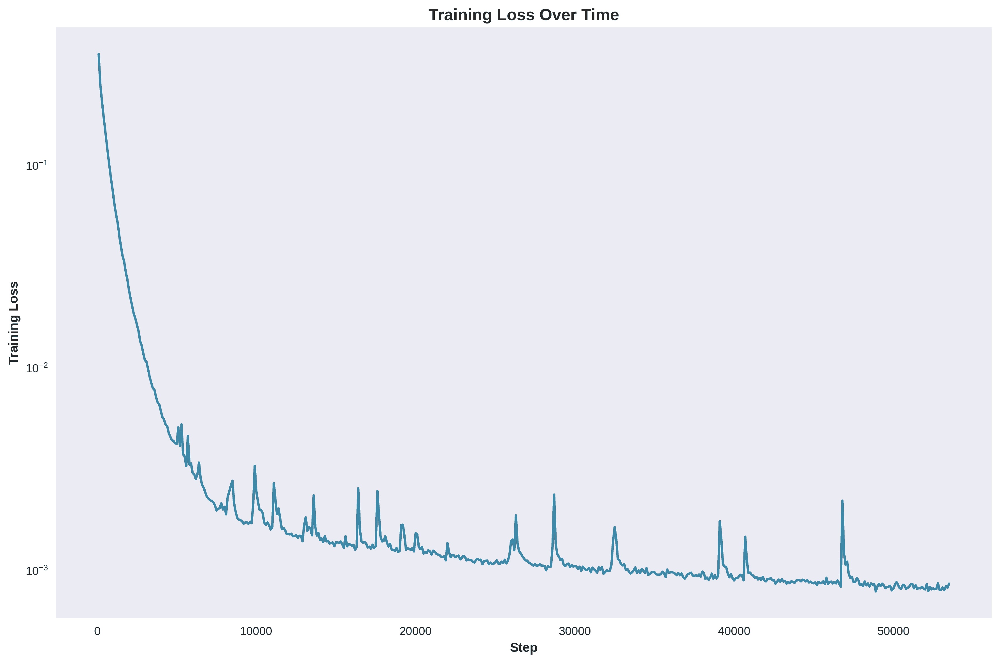
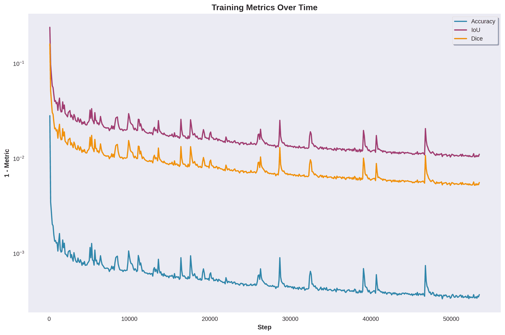
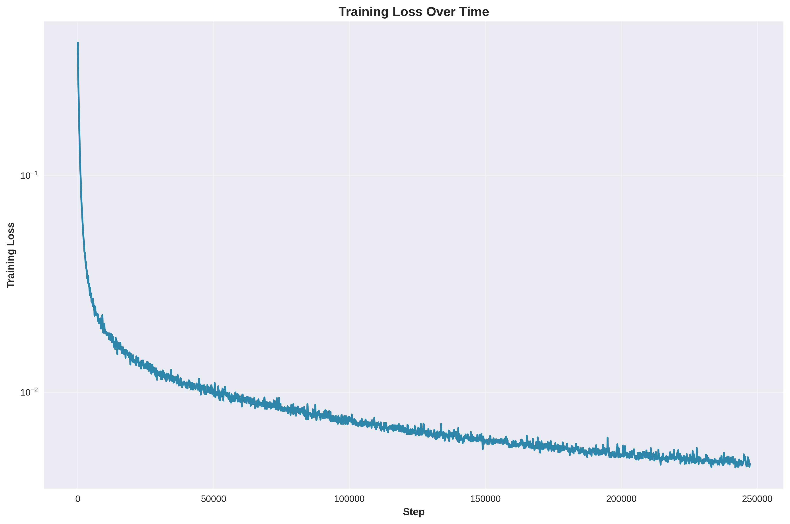
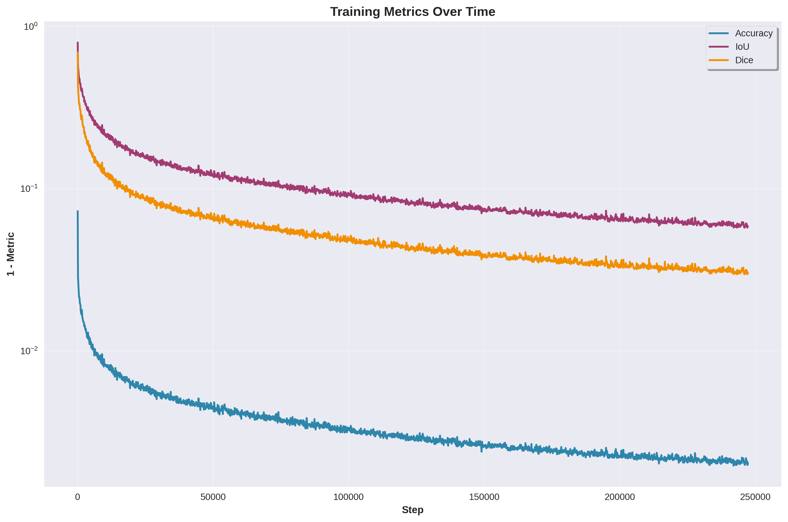

# Mask Generator

This repository contains Python scripts for image augmentation, mask cleaning, ray casting analysis, and training a U-Net model for track limit segmentation, supporting both simulation and real-world imagery.

## Directory Structure

- `Images/`: Contains all input and mask images. Must be unzipped first.
- `Models/`: Pretrained models ready for inference.
- `InputLines/`: Original simulation input images.
- `MaskLines/`: Original simulation mask images.
- `InputNoLines/`: Raw simulation images.
- `MaskNoLines/`: Raw simulation masks needing cleaning.
- `InputReal/`: Original real-world input images.
- `AugmentedInputLines/`: Augmented original simulation input images.
- `AugmentedMaskLines/`: Augmented original simulation masks.
- `AugmentedInputNoLines/`: Augmented raw simulation input images.
- `AugmentedMaskNoLines/`: Augmented raw simulation masks.
- `AugmentedInputReal/`: Augmented real-world input images.
- `MaskCleaned/`: Cleaned masks (output from `MaskCleaner.py`).
- `MaskDebug/`: Debug visualizations from `MaskCleaner.py`.
- `MaskRayCast/`: Images with ray casts from `RayMain.py`.
- `MetricsLines/`: Metrics plots from `Metrics.py`.
- `MetricsNoLines/`: Metrics plots from `Metrics.py`.
- `best.pth`: Default path for the saved best trained model.
- `metrics.csv`: CSV file to log training metrics.

## Scripts

### 1. `Augment.py`

Augments images and their corresponding masks.
- Default behavior: Processes `InputLines` and `MaskLines`, saving to `AugmentedInputLines` and `AugmentedMaskLines`.
- For "NoLine" data: Modify the `input_dir`, `mask_dir`, `aug_input_dir`, `aug_mask_dir` variables within the script to point to `InputNoLines`, `MaskNoLines`, `AugmentedInputNoLines`, `AugmentedMaskNoLines` respectively.

Usage:
```bash
python Augment.py
```
- Ensure input and mask directories are populated with paired images (same filenames).
- Configuration (e.g., `num_augmentations`) can be changed within the script.

### 2. `MaskCleaner.py`

Cleans mask images by isolating lane lines.

Usage:
```bash
python MaskCleaner.py
```
- Input masks to be cleaned are read from `MaskNoLines/`.
- Background debugging images are read from `InputNoLines/`.
- Cleaned masks are saved to `MaskCleaned/`.
- Debug visualizations are saved to `MaskDebug/`.

### 3. `RayMain.py` (uses `RayCast.py`)

Performs ray casting from the bottom-center of images.
- Default behavior: Processes images from `MaskLines/`. Modify `input_dir` in `RayMain.py` to target other directories.

Usage:
```bash
python RayMain.py
```
- Outputs images with drawn rays to `MaskRayCast/`.

### 4. `Train.py`

Trains, tests, or uses a U-Net model for semantic segmentation.
- Default behavior: Uses `AugmentedInputLines/` and `AugmentedMaskLines/` for training.
- For "NoLines" data: Modify the `image_dir` and `mask_dir` variables at the top of `Train.py` to `AugmentedInputNoLines` and `AugmentedMaskNoLines`.

#### Usage:

To train:
```bash
python Train.py --train
```
- The best model will be saved to `best.pth` (or as specified by `--model`).
- Training metrics logged to `metrics.csv`.

To test:
```bash
python Train.py --test [--model model.pth]
```

To convert a single image:
```bash
python Train.py --convert input_image.png output_mask.png [--model model.pth]
```

### 4. `Metrics.py`

Draws various plots for each metric in the training logs`
- Default behavior: Processes metrics from `metrics.csv`.

Usage:
```bash
python Metrics.py
```
- Outputs images will be drawn to `metrics_plots/`.

#### `MetricsLines/` plots

| Loss Plot | Combined Metrics Plot |
|-----------|-----------------------|
|  |  |

#### `MetricsNoLines/` plots

| Loss Plot | Combined Metrics Plot |
|-----------|-----------------------|
|  |  |

These plots show the training performance comparison between models trained on original simulation data (with visible track lines) versus raw simulation data. The loss plots track training convergence, while the metrics plots show the combined performance of Accuracy, IoU, and Dice coefficients over training steps.

## Dependencies

- Python 3.12
- PyTorch
- Torchvision
- Pillow
- NumPy
- MatPlotLib
- Seaborn
- tqdm

To install:
```bash
uv venv --python 3.12
source .venv/bin/activate
uv pip install Pillow numpy tqdm torch torchvision seaborn matplotlib
```
or (slower):
```
python3.12 -m venv .venv
source .venv/bin/activate
pip install Pillow numpy tqdm torch torchvision seaborn matplotlib
```
